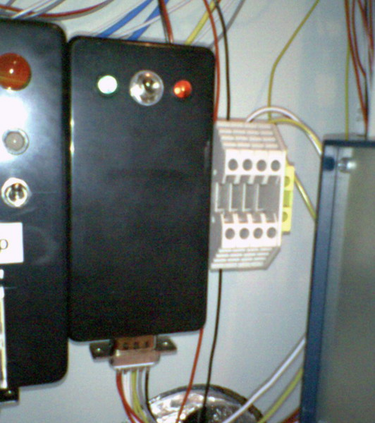

## Source code for project: [Electric heater and timer controller](https://link.stdout.no/d)

Uses an AVR AT90S2313 microcontroller.

Written in basic, using [Bascom-AVR](http://www.mcselec.com/).

### Author
[Thomas Jensen](https://thomas.stdout.no)
